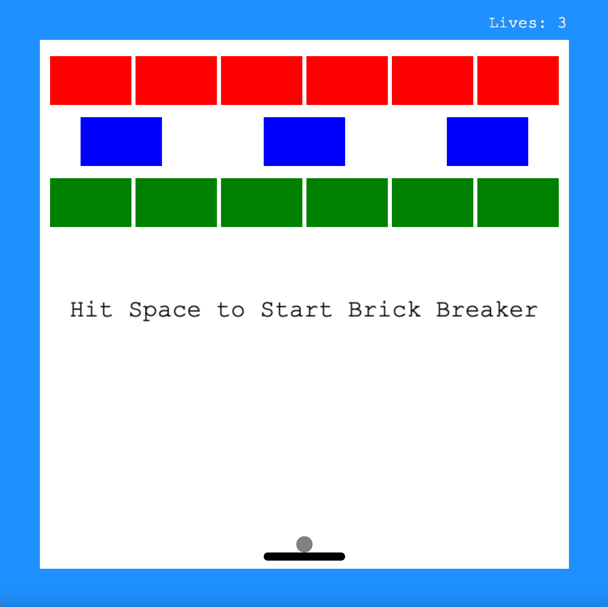

###About
This is a video game that is inspired by the BlackBerry game Brick Breaker. I wrote this application in C++ using the Cinder, glm, and nlohmann library.

###Instructions
The game gives the user control of the paddle which is used to reflect the ball towards a large collection of bricks and destroying all of them in order to win complete the game.

####Bricks
* Red Bricks: This is the strongest Brick and takes three hits to destroy the brick.
* Blue Bricks: This is the middle level Brick and it takes two hits to destroy this brick. 
* Green Bricks: This is the weakest group of bricks and only takes one hit to destroy this brick. 

####Lives
* The player has 3 Lives.
* These 3 lives are transferred within all of the levels and must be used to complete all 4 levels of the game. 

###Run
* Clone the Repository
* Build the Project
* Run the Project (brick-breaker)

###Images
